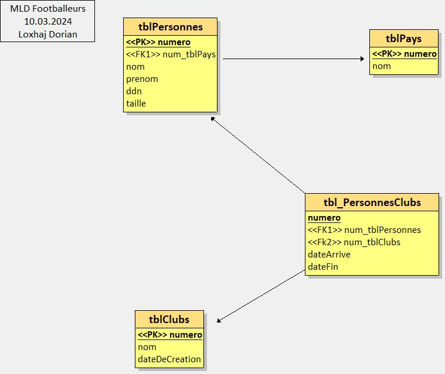

# Footballeurs

Ce projet s'inscrit dans le cadre du cours d'application de méthodes numériques pour les sciences humaines et historiques dirigé par Francesco Beretta.
Il se concentre sur les joueurs composant l'équipe du Real Madrid à travers les années.

# MCD / MLD
Ces modèles conceptuel / logique de données ont été dessinés avec l'outil looping. Une version faites avec drawio est également disponible. **Ce sont des ébauches et non des produits fini !**

*Modèle Conceptuel de Données*

*Modèle Logique de Données*
